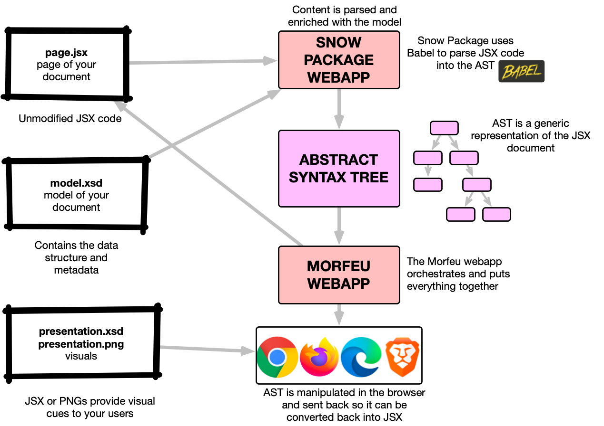

# Snow Package
Morfeu compatibility service for JS, includes support for JSX file format.

## How it works

Please refer to the [Morfeu](https://github.com/danigiri/morfeu) documentation for further information.

## Development

    # build the morfeu library
    cd morfeu && \
        mvn package war:war install \
        -DarchiveClasses=true -DattachClasses=true -DskipITs -DskipTests=true -Djetty.skip -Dskip-build-client=true 
    
    # start morfeu pointing at the host and port where we will run the snow package app
    cd morfeu && mvn compile jetty:run \
        -D__RESOURCES_PREFIX=http://localhost:8990/ \
        -D__PROXY_PREFIX=http://localhost:8990
        
    # start the morfeu frontend
    cd morfeu/src/main/angular && npm start # ng serve --port 3000 --proxy-config proxy.conf.js --liveReload=true

    # start the snow package app
    mvn compile resources:resources jetty:run -D__RESOURCES_PREFIX=file://$(pwd)/target/classes/

    # browser URL
    http://localhost:3000/?config=%2Fproxy%2Fconfig.json

## License

> Copyright 2021 Daniel Giribet
>
> Licensed under the Apache License, Version 2.0 (the "License");
> you may not use this file except in compliance with the License.
> You may obtain a copy of the License at

>   http://www.apache.org/licenses/LICENSE-2.0

> Unless required by applicable law or agreed to in writing, software
> distributed under the License is distributed on an "AS IS" BASIS,
> WITHOUT WARRANTIES OR CONDITIONS OF ANY KIND, either express or implied.
> See the License for the specific language governing permissions and
> limitations under the License.
    